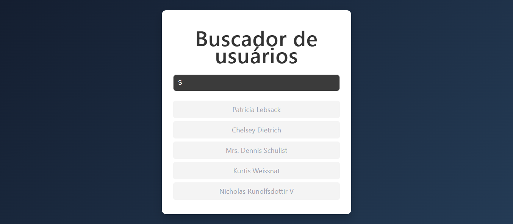
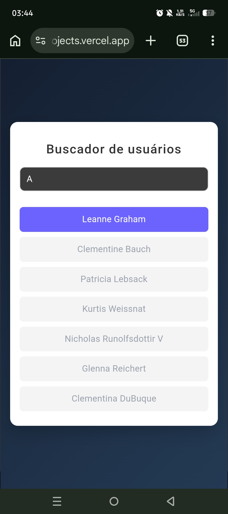

# 🔍 Buscador de Usuários - React

Aplicação desenvolvida em React para busca dinâmica de usuários utilizando consumo de API, debounce e renderização condicional.

---

## 📸 Preview

<p align="center">
  
</p>

<p align="center">
  
</p>

---

## 🔗 Deploy

🔗 [Acessar projeto](https://busca-usuarios.vercel.app/)

---

## 🚀 Funcionalidades

- Buscar usuários em tempo real
- Filtrar usuários pelo nome
- Debounce para otimizar requisições
- Consumo de API externa
- Tratamento de erros
- Indicador de carregamento
- Layout responsivo

---

## 🛠️ Tecnologias utilizadas

- React
- JavaScript
- CSS3
- Vite
- JSONPlaceholder API

---

## 📚 Conceitos praticados

Este projeto foi desenvolvido com foco em prática de conceitos de nível júnior, incluindo:

- useState
- useEffect
- Consumo de API com fetch
- Debounce
- Async/Await
- Tratamento de erros
- Manipulação de arrays com filter
- Renderização condicional
- Responsividade com CSS

---

## 📱 Responsividade

Interface adaptada para:

- Mobile
- Tablet
- Desktop

---

## ⚙️ Como executar o projeto

Clone o repositório:

```bash
git clone https://github.com/PatrickCorrea-git/Busca_usuarios.git
```

Entre na pasta do projeto:

```bash
cd Busca_usuarios
```

Instale as dependências:

```bash
npm install
```

Execute o projeto:

```bash
npm run dev
```

---

## 🌐 API utilizada

Este projeto utiliza a API pública:

- https://jsonplaceholder.typicode.com/users

---

## 👨‍💻 Autor

- Desenvolvido por Patrick Corrêa.

- GitHub: [PatrickCorrea-git](https://github.com/PatrickCorrea-git)
